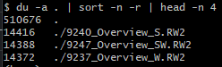
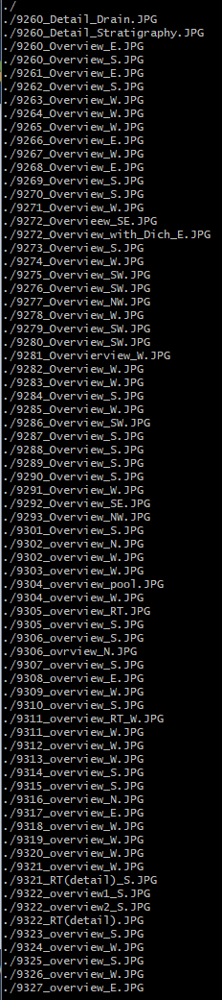
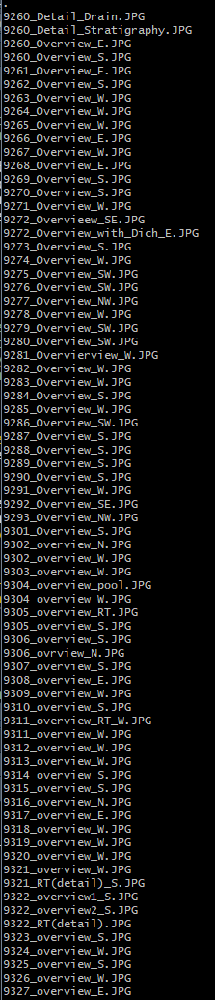

Your supervisor has shared a folder of photos on Sciencedata.dk with you (password is *******, folder is 500Mb and contains 189 images) and needs your help with a couple diagnostics:

**1) Identify the names and format of the 3 biggest files. Can you come up with a command to generate a numerically ordered list of 3 biggest files? (hint: try using the wc command)**

I use the command `du -a . | sort -n -r | head -n 4` to get 1) file space usage, 2) sort the files by file size and 3) show only the 4 largest files. In this case, the output is: 

From this, we gather that the names and formats of the three biggest files are:

| File name | Format |
| --- | --- |
| 9240_Overview_S | RW2 |
| 9247_Overview_SW | RW2 |
| 9237_Overview_W | RW2 |

**2) Some of the image files are empty, a sign of error in the data processing or corruption. Generate a list of empty photo filenames to facilitate their later replacement easier? (hint: look up find)**

I write `find ./ -size 0` to find all files that have a size of zero bytes. I double-check with the above command `du -a . | sort -n` where I sort without the `-r` tag, meaning I don't reverse-sort it. I also exclude `head` since I want to see all files. It seems to be correct. The output from `find` becomes:

**3) CHALLENGE (Easy to Medium): Write a shell script called emptyfiles.sh that takes the name of a directory and generates a list of empty photo filenames (remember to pick up all extensions) . So that, for example, running $ bash emptyfiles.sh Downloads/badphotos produces a list of empty file filenames either in the terminal or in an external textfile. Can you eliminate the ./ notation at the start of the filename?**

To create a bash script called `emptyfiles.sh`, I write `nano emptyfiles.sh` to create/edit the file `emptyfiles.sh`. In this file, I write: `find "$1" -size 0 | sed 's/^\.\///'`.

Here, we repeat the earlier statement `find dir -size 0` where `dir` is replaced by `"$1"` which means the shell script's first input. Then we pipe that with `|` into `sed 's/^\.\///'` to remove the `.` and `/` at the start of the file. This is a type of regex implementation.

Then we save the file with `Ctrl+O + Enter` and close with `Ctrl+X`. To run the script, we just write `bash emptyfiles.sh .` where `.` is the input directory that the script is run on. The output then becomes:

**NOT DONE:**
**4) CHALLENGE (Advanced): Imagine you have a directory goodphotos/ (same password as above) with original non-zero-length files sitting at the same level as the current directory. How would you write a loop to replace the zero-length files?**